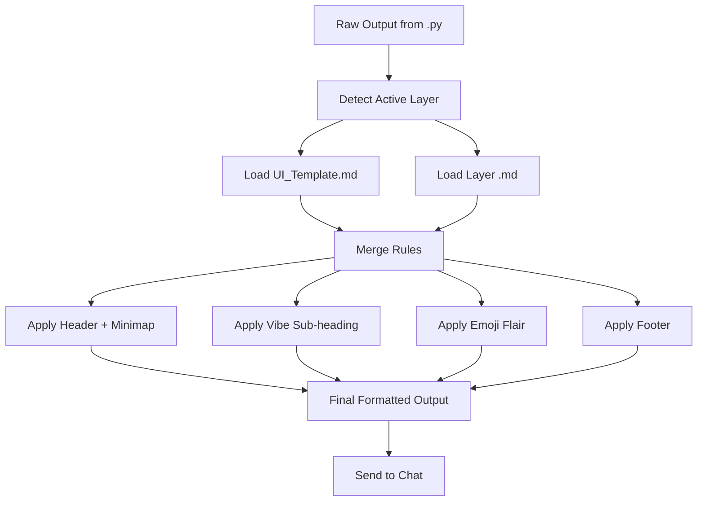

# ui-manager.md — UI Manager Component (v1.0)

**Purpose:** Central UI formatting engine. Reads `UI_Template.md` + layer-specific rules and applies them to all chat output.

**Status:** Missing Component — Required for Layer UIs to Work  
**Location:** `chaos-engine/ui_manager.py` + `ui-manager.md`  
**Last Updated:** 2026-04-28

---

## 0. Overview

The **UI Manager** is the missing component that makes Layer UIs actually apply.

It:
- Detects the current active layer (`/casual`, `/dev`, `/roleplay`, `/void`, etc.)
- Reads `UI_Template.md` (base template)
- Reads current layer `.md` rules
- Reads `EmojiPalette.md` (flair definitions)
- Applies headers, minimaps, footers, vibe sub-headings, emoji palettes, and density rules
- Formats the final output before sending to chat

Without this, all layer rules exist but are never used.

---

## 1. Core Functions

### 1.1 Detect Active Layer
- Reads current layer from ChaosEngine state
- Falls back to `/casual` if none set

### 1.2 Load UI Rules
- Reads `UI_Template.md` (base template)
- Reads current layer `.md` (overrides + specific rules)
- Reads `EmojiPalette.md` (flair definitions)

### 1.3 Apply Formatting
- Builds header (layer name + turn + timestamp + minimap)
- Adds vibe sub-heading (if EmotionNet is active)
- Applies emoji flair (left-aligned, max 4 per response)
- Enforces density rules
- Adds footer
- Returns fully formatted output

### 1.4 Handle Special Cases
- `/void` mode → ultra-minimal single-line output
- `/export` mode → zero-UI by default (pure payload)
- Boot flair → one-time visual on first response

---

## 2. Integration with ChaosEngine

```
User Input
        ↓
ChaosEngine.route_intent()
        ↓
.py runs → Raw result
        ↓
ui_manager.format_output(raw_result, current_layer)
        ↓
Formatted output → Sent to chat
```

**ChaosEngine calls `ui_manager.format_output()` before every response.**

---

## 3. Key Methods (Python)

```python
class UIManager:
    def __init__(self):
        self.template = load_ui_template()
        self.emoji_palette = load_emoji_palette()

    def format_output(self, raw_output: str, layer: str) -> str:
        rules = self.get_layer_rules(layer)
        formatted = self.apply_header(raw_output, rules)
        formatted = self.apply_vibe_subheading(formatted, rules)
        formatted = self.apply_emoji_flair(formatted, rules)
        formatted = self.apply_footer(formatted, rules)
        return formatted

    def get_layer_rules(self, layer: str) -> dict:
        # Load UI_Template.md + layer .md
        # Merge rules with layer overrides
        pass
```

---

## 4. Decision Flow



---

## 5. Summary

**UI Manager** is the glue between:
- All the beautiful UI rules we defined (`UI_Template.md`, layer `.md` files)
- The actual chat output the user sees

It is **required** for Layer UIs to work.

**Next Step:** Create `chaos-engine/ui_manager.py` implementation.

---

**This is the missing component. Once built, Layer UIs will finally apply.**
